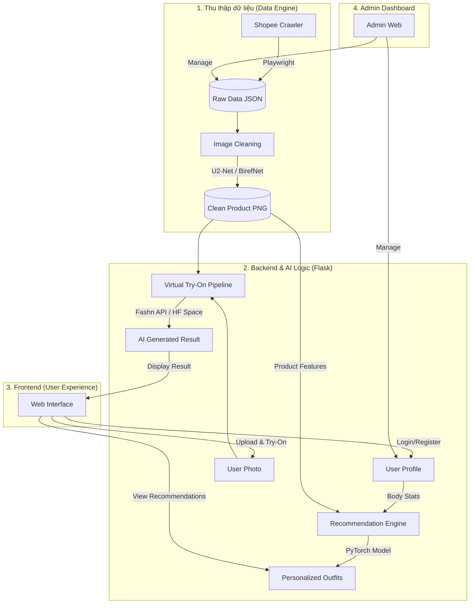

# 📊 Quy trình hoạt động & Công nghệ dự án Fitting AI

Tài liệu này tổng hợp luồng hoạt động (workflow), các công cụ (tools) và công nghệ (technologies) được sử dụng trong hệ thống **AI Virtual Fitting & Style Recommendation**.

## 1. Sơ đồ quy trình hoạt động (System Flow)

---

## 2. Công cụ & Công nghệ sử dụng

Hệ thống được xây dựng trên nền tảng **Full-stack Python & JavaScript** với sự hỗ trợ mạnh mẽ từ các mô hình **AI**.

### 🔹 Backend (Trung tâm xử lý)
*   **Ngôn ngữ:** Python 3.10+
*   **Framework:** **Flask** (Lightweight web server)
*   **Database:** **SQLite** (Quản lý User, Sản phẩm, Lịch sử thử đồ)
*   **Thư viện hỗ trợ:** `SQLAlchemy` (ORM), `Flask-CORS`, `python-dotenv`.

### 🔹 Frontend (Giao diện người dùng)
*   **Ngôn ngữ:** HTML5, CSS3, JavaScript (Vanilla JS).
*   **Phong cách thiết kế:** **Pastel Minimalism** (Tinh tế, hiện đại).
*   **Logic:** Gọi API bằng `fetch`, xử lý DOM động để hiển thị kết quả AI.

### 🔹 AI & ML (Trí tuệ nhân tạo)
*   **Deep Learning Framework:** **PyTorch** (Dùng cho Recommender System).
*   **Computer Vision:**
    *   **YOLOv8:** Phát hiện và phân loại trang phục.
    *   **U2-Net / BirefNet:** Tự động tách nền (Background Removal) để làm sạch ảnh sản phẩm.
*   **Virtual Try-On (VTON):**
    *   **VITON-HD:** Mô hình thử đồ ảo chất lượng cao.
    *   **External APIs:** Tích hợp **Fashn VTON API** và **Hugging Face Spaces**.

### 🔹 Data & Tools (Công cụ hỗ trợ)
*   **Crawling:** **Playwright** (Tự động hóa trình duyệt để lấy dữ liệu từ Shopee).
*   **Process Management:** **Node.js (npm)** (Sử dụng lệnh `npm start` để chạy song song Backend & Frontend).
*   **Environment:** Windows/Linux, sử dụng [.env](file:///c:/Mai/4/.env) để quản lý Token AI bảo mật.

---

## 3. Các bước trải nghiệm chính
1.  **Crawl & Clean:** Hệ thống tự động đi lấy dữ liệu váy áo và dùng AI xóa phông nền.
2.  **Analysis:** Người dùng nhập số đo, AI phân tích hình thể (Body Shape).
3.  **Match:** AI gợi ý những bộ đồ phù hợp nhất từ kho dữ liệu đã crawl.
4.  **Try-On:** Người dùng tải ảnh cá nhân lên, AI "mặc" bộ đồ đã chọn vào ảnh của người dùng.
